# 🏠 Property Management System — Salesforce CRM

<div align="center">


**A fully functional Salesforce CRM application built to manage real estate operations — properties, clients, interests, agents, and commissions — using Salesforce's declarative and configuration tools.**

[📋 Overview](#-project-overview) · [🚀 Features](#-features) · [🗃️ Data Model](#️-data-model--relationships) · [📸 Screenshots](#-screenshots) · [⚙️ Setup](#️-installation--setup)

</div>

---

## 📋 Project Overview

The **Property Management System** is a fully declarative Salesforce CRM solution designed for a real estate company. It enables agents to manage property listings, track client preferences, and record client-property interests — all within a purpose-built Lightning App.

The system uses **custom objects**, **master-detail relationships**, **formula fields**, **validation rules**, **record types**, **role hierarchies**, and **permission sets** to create a scalable, secure, and production-grade CRM application.

> 🎯 Built as part of a Salesforce Administrator/Developer portfolio to demonstrate hands-on expertise in Salesforce configuration, data modelling, security, and automation.

---

## ✨ Features

### ✅ Feature Checklist

| Feature | Description | Status |
|---|---|---|
| ⚡ Lightning App | Unified workspace for agents | ✅ Complete |
| 🏢 Custom Objects | Property, Client, Interest | ✅ Complete |
| 🔗 Relationships | Master-Detail & Lookup | ✅ Complete |
| 🗂️ Record Types | Residential/Commercial, Buyer/Renter | ✅ Complete |
| 🧮 Formula Field | Auto-calculated commission (3%) | ✅ Complete |
| 🛡️ Validation Rule | Enforce required Price field | ✅ Complete |
| 👤 Roles | Sales Manager, Agent, Support | ✅ Complete |
| 🔐 Profiles | Agent Profile & Support Profile | ✅ Complete |
| 🔑 Permission Set | Premium Agent Access | ✅ Complete |
| 📄 Page Layouts | Custom layouts per object | ✅ Complete |
| 🧪 Sample Records | Test data for all objects | ✅ Complete |

---

## 🎯 Objectives

- ✅ Build a **scalable data model** for real estate operations using Salesforce custom objects
- ✅ Implement a **many-to-many relationship** between Properties and Clients via a junction object
- ✅ Automate **commission calculations** using formula fields
- ✅ Enforce **data integrity** through validation rules
- ✅ Configure a **role hierarchy** to control record visibility
- ✅ Apply **profiles and permission sets** to manage user access
- ✅ Organize the experience using **record types** and **page layouts**

---

## 🛠️ Salesforce Technologies Used

```
📦 Salesforce Platform
 ├── ⚡ Lightning App Builder
 ├── 🗂️ Custom Objects & Fields
 ├── 🔗 Master-Detail & Lookup Relationships
 ├── 📋 Record Types
 ├── 🖼️ Page Layouts
 ├── 🧮 Formula Fields
 ├── 🛡️ Validation Rules
 ├── 🔐 Profiles & Permission Sets
 ├── 👥 Roles & Role Hierarchy
 └── 👤 Users
```

---

## ⚡ Custom App

### 🏠 Property Management Lightning App

The **Property Management** Lightning App serves as the central workspace for real estate operations. It provides agents with a unified navigation bar that surfaces the three core custom objects: **Property**, **Client**, and **Interest**.

| App Setting | Value |
|---|---|
| App Name | Property Management |
| App Type | Lightning App |
| Navigation Items | Property, Client, Interest |
| User Visibility | Real Estate Agent Profile, Customer Support Profile |

---

## 🗃️ Custom Objects

### 🏢 Property Object

Stores details about all real estate listings available for sale or rent.

| Field Label | API Name | Field Type | Description |
|---|---|---|---|
| Property Name | `Name` | Text (Auto) | Auto-generated unique property identifier |
| Price | `Price__c` | Currency | Listed price of the property |
| Status | `Status__c` | Picklist | Active, Sold, Rented, Under Review |
| Property Type | `Property_Type__c` | Picklist | Apartment, Villa, Office, Warehouse |
| Size (sq ft) | `Size__c` | Number | Total area of the property |
| Owner | `Owner__c` | Lookup (User) | Agent responsible for the listing |

---

### 👤 Client Object

Maintains records of prospective buyers and renters.

| Field Label | API Name | Field Type | Description |
|---|---|---|---|
| Client Name | `Name` | Text (Auto) | Auto-generated client identifier |
| Budget | `Budget__c` | Currency | Maximum budget the client can afford |
| Preferred Location | `Preferred_Location__c` | Text | City or area the client prefers |
| Client Type | `Client_Type__c` | Picklist | Buyer or Renter |
| Email | `Email__c` | Email | Primary contact email |
| Phone | `Phone__c` | Phone | Primary contact phone number |

---

### 🔁 Interest Object *(Junction Object)*

Acts as a **many-to-many junction** between Property and Client. Tracks which clients are interested in which properties, and stores agent and commission details.

| Field Label | API Name | Field Type | Description |
|---|---|---|---|
| Interest Name | `Name` | Text (Auto) | Auto-generated interest identifier |
| Property | `Property__c` | Master-Detail (Property) | Linked property |
| Client | `Client__c` | Master-Detail (Client) | Linked client |
| Agent | `Agent__c` | Lookup (User) | Assigned agent for this interest |
| Status | `Status__c` | Picklist | New, In Progress, Closed, Lost |
| Date of Interest | `Date_of_Interest__c` | Date | Date when interest was registered |
| Potential Commission | `Potential_Commission__c` | Formula (Currency) | Auto-calculated = Property Price × 3% |

---

## 🔗 Data Model & Relationships

### Architecture Overview

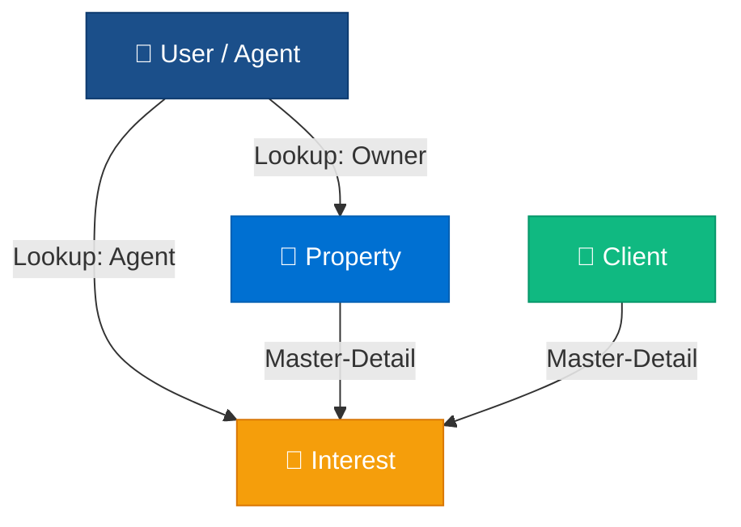
```mermaid
graph TD
    A[👤 User / Agent] -->|Lookup: Owner| B[🏢 Property]
    A -->|Lookup: Agent| C[🔁 Interest]
    B -->|Master-Detail| C
    D[👥 Client] -->|Master-Detail| C

    style A fill:#1b4f8a,color:#fff,stroke:#0d3a6e
    style B fill:#0070d2,color:#fff,stroke:#005fb2
    style C fill:#f59e0b,color:#fff,stroke:#d97706
    style D fill:#10b981,color:#fff,stroke:#059669
```

### Relationship Diagram

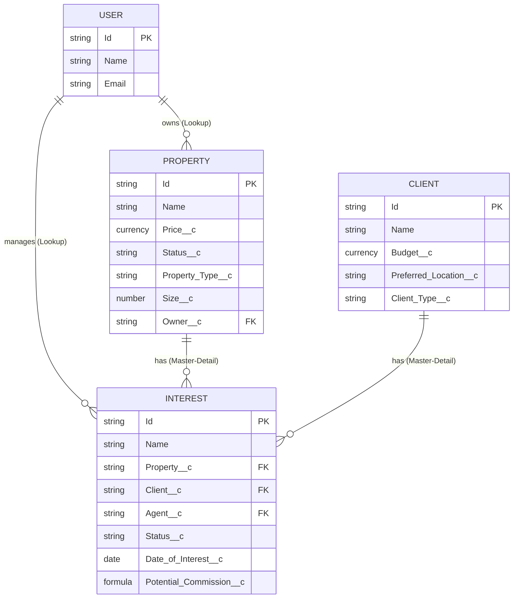
```mermaid
erDiagram
    USER {
        string Id PK
        string Name
        string Email
    }
    PROPERTY {
        string Id PK
        string Name
        currency Price__c
        string Status__c
        string Property_Type__c
        number Size__c
        string Owner__c FK
    }
    CLIENT {
        string Id PK
        string Name
        currency Budget__c
        string Preferred_Location__c
        string Client_Type__c
    }
    INTEREST {
        string Id PK
        string Name
        string Property__c FK
        string Client__c FK
        string Agent__c FK
        string Status__c
        date Date_of_Interest__c
        formula Potential_Commission__c
    }

    USER ||--o{ PROPERTY : "owns (Lookup)"
    USER ||--o{ INTEREST : "manages (Lookup)"
    PROPERTY ||--o{ INTEREST : "has (Master-Detail)"
    CLIENT ||--o{ INTEREST : "has (Master-Detail)"
```

### Relationship Summary

| Relationship | Type | Parent | Child | Purpose |
|---|---|---|---|---|
| Property → Interest | Master-Detail | Property | Interest | Interest deleted when Property is deleted |
| Client → Interest | Master-Detail | Client | Interest | Interest deleted when Client is deleted |
| Property → Owner | Lookup | User | Property | Track property listing owner |
| Interest → Agent | Lookup | User | Interest | Track assigned agent per interest |

---

## 🗂️ Record Types

Record Types allow different business processes and page layouts per object.

### 🏢 Property Record Types

| Record Type | Description | Use Case |
|---|---|---|
| **Residential** | Homes, Apartments, Villas | Used for buyer/renter residential listings |
| **Commercial** | Offices, Warehouses, Retail | Used for business property listings |

### 👥 Client Record Types

| Record Type | Description | Use Case |
|---|---|---|
| **Buyer** | Client intending to purchase | Displays purchase-relevant fields |
| **Renter** | Client intending to lease | Displays rental-relevant fields |

### 🔁 Interest Record Types

| Record Type | Description | Use Case |
|---|---|---|
| **Purchase Interest** | Client interested in buying | Linked to Buyer clients & Property listings |
| **Rental Interest** | Client interested in renting | Linked to Renter clients & Property listings |

---

## 🖼️ Page Layout Customizations

Page Layouts were customized per object and record type to improve agent productivity.

| Object | Layout Name | Key Customizations |
|---|---|---|
| Property | Residential Layout | Price, Size, Status, Owner, Interests related list |
| Property | Commercial Layout | Price, Property Type, Size, Owner, Interests related list |
| Client | Buyer Layout | Budget, Preferred Location, Email, Phone, Interests related list |
| Client | Renter Layout | Budget, Preferred Location, Client Type, Interests related list |
| Interest | Interest Layout | Property (M-D), Client (M-D), Agent, Status, Date, Commission |

> 💡 The **Interests related list** is added to both Property and Client layouts, enabling agents to view all linked interests from the parent record directly.

---

## 👥 Roles

A three-tier role hierarchy was established to control record visibility through Salesforce's **Role-Based Sharing Model**.

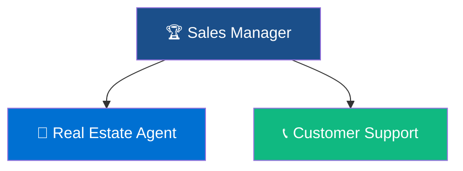
```mermaid
graph TD
    A[🏆 Sales Manager] --> B[🤝 Real Estate Agent]
    A --> C[📞 Customer Support]

    style A fill:#1b4f8a,color:#fff
    style B fill:#0070d2,color:#fff
    style C fill:#10b981,color:#fff
```

| Role | Access Level | Reports To |
|---|---|---|
| **Sales Manager** | Full access to all records | — (Top of Hierarchy) |
| **Real Estate Agent** | Access to own records + subordinates | Sales Manager |
| **Customer Support** | Read-only visibility on shared records | Sales Manager |

---

## 🔐 Profiles

Custom profiles define **object-level CRUD permissions** for each user group.

| Profile | Property Access | Client Access | Interest Access | Notes |
|---|---|---|---|---|
| **Real Estate Agent Profile** | Read, Create, Edit, Delete | Read, Create, Edit, Delete | Read, Create, Edit, Delete | Full operational access |
| **Customer Support Profile** | Read Only | Read Only | Read Only | View-only for support queries |

---

## 🔑 Permission Set

### Premium Agent Access

A **Permission Set** was created to extend specific permissions to selected agents beyond their base profile — without requiring a separate profile.

| Permission | Granted |
|---|---|
| View All Properties | ✅ Yes |
| Edit All Interests | ✅ Yes |
| Run Reports | ✅ Yes |
| Export Data | ✅ Yes |

> ℹ️ Permission Sets follow the **principle of least privilege** — they only grant additional permissions on top of an existing profile; they never restrict.

---

## 🧮 Formula Field — Potential Commission

The `Potential_Commission__c` formula field on the **Interest** object automatically calculates the agent's estimated commission.

```
Potential Commission = Property Price × 3%
```

**Formula:**
```
Property__r.Price__c * 0.03
```

| Property Price | Potential Commission |
|---|---|
| ₹50,00,000 | ₹1,50,000 |
| ₹1,20,00,000 | ₹3,60,000 |
| ₹75,00,000 | ₹2,25,000 |

> ✅ This eliminates manual commission calculations and ensures 100% accuracy across all interest records.

---

## 🛡️ Validation Rule — EnsurePrice

Prevents agents from saving a Property record without entering a price.

| Setting | Value |
|---|---|
| Rule Name | `EnsurePrice` |
| Object | Property |
| Error Condition Formula | `ISBLANK(Price__c)` |
| Error Message | *"Price is required. Please enter the property price before saving."* |
| Error Location | Field: Price |

**Behaviour:** When an agent attempts to save a Property record with a blank Price field, Salesforce blocks the save and displays the error message directly on the Price field.

---

## 🧪 Sample Records

Sample records were created to validate the full data model and relationships.

### 🏢 Property Records

| Property Name | Price | Type | Status | Record Type |
|---|---|---|---|---|
| Sunset Villa, Banjara Hills | ₹1,20,00,000 | Villa | Active | Residential |
| Tech Park Office Suite 4B | ₹85,00,000 | Office | Active | Commercial |
| Green Valley Apartment 3C | ₹45,00,000 | Apartment | Active | Residential |

### 👥 Client Records

| Client Name | Budget | Preferred Location | Record Type |
|---|---|---|---|
| Arjun Mehta | ₹1,50,00,000 | Banjara Hills, Hyderabad | Buyer |
| Priya Sharma | ₹50,000/month | Gachibowli, Hyderabad | Renter |
| TechSolutions Pvt. Ltd. | ₹1,00,00,000 | HITEC City, Hyderabad | Buyer |

### 🔁 Interest Records

| Interest | Property | Client | Agent | Status | Commission |
|---|---|---|---|---|---|
| INT-0001 | Sunset Villa | Arjun Mehta | Ravi Kumar | In Progress | ₹3,60,000 |
| INT-0002 | Tech Park Office | TechSolutions | Meena Reddy | New | ₹2,55,000 |
| INT-0003 | Green Valley Apt | Priya Sharma | Ravi Kumar | New | ₹1,35,000 |

---

## 🔄 Project Workflow

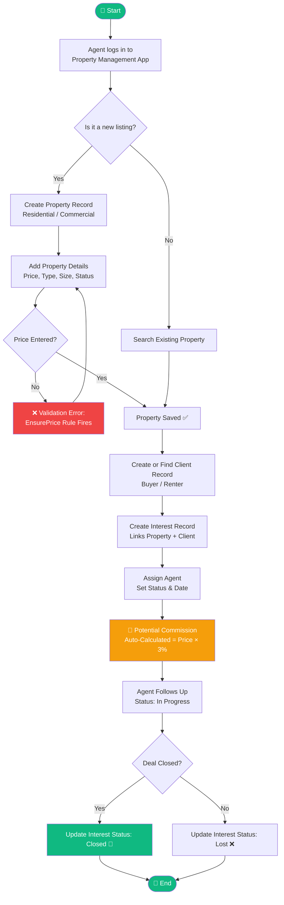
```mermaid
flowchart TD
    A([🚀 Start]) --> B[Agent logs in to\nProperty Management App]
    B --> C{Is it a new listing?}
    C -- Yes --> D[Create Property Record\nResidential / Commercial]
    C -- No --> E[Search Existing Property]
    D --> F[Add Property Details\nPrice, Type, Size, Status]
    F --> G{Price Entered?}
    G -- No --> H[❌ Validation Error:\nEnsurePrice Rule Fires]
    H --> F
    G -- Yes --> I[Property Saved ✅]
    E --> I
    I --> J[Create or Find Client Record\nBuyer / Renter]
    J --> K[Create Interest Record\nLinks Property + Client]
    K --> L[Assign Agent\nSet Status & Date]
    L --> M[🧮 Potential Commission\nAuto-Calculated = Price × 3%]
    M --> N[Agent Follows Up\nStatus: In Progress]
    N --> O{Deal Closed?}
    O -- Yes --> P[Update Interest Status: Closed 🎉]
    O -- No --> Q[Update Interest Status: Lost ❌]
    P --> R([🏁 End])
    Q --> R

    style A fill:#10b981,color:#fff
    style R fill:#10b981,color:#fff
    style H fill:#ef4444,color:#fff
    style M fill:#f59e0b,color:#fff
    style P fill:#10b981,color:#fff
```

---

## 📁 Folder Structure

```
Property-Management-System-Salesforce/
│
├── 📄 README.md                          # Project documentation
│
├── 📂 screenshots/                       # All UI screenshots
│   ├── 01_Property_Management_App.png
│   ├── 02_Property_Object.png
│   ├── 03_Client_Object.png
│   ├── 04_Interest_Object.png
│   ├── 05_Property_Record.png
│   ├── 06_Client_Record.png
│   ├── 07_Interest_Record.png
│   ├── 08_Record_Types.png
│   ├── 09_Page_Layout.png
│   ├── 10_Master_Detail_Relationships.png
│   ├── 11_Lookup_Relationships.png
│   ├── 12_Validation_Rule.png
│   ├── 13_Validation_Test.png
│   ├── 14_Formula_Field.png
│   ├── 15_Permission_Set.png
│   ├── 16_Roles.png
│   ├── 17_Profiles.png
│   ├── 18_Users.png
│   ├── 19_Property_Client_Relationship.png
│   └── 20_Project_Overview.png
│
└── 📂 docs/                              # Optional extended documentation
    └── data-model.md
```

---

## 📸 Screenshots

> 📌 All screenshots are stored in the `/screenshots` folder. Below are the key visuals from the project.

| # | Screenshot | Description |
|---|---|---|
| 01 | 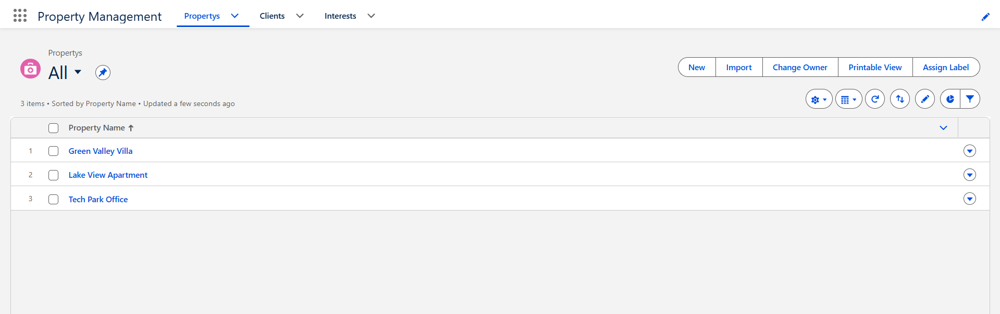 | Property Management Lightning App |
| 02 | 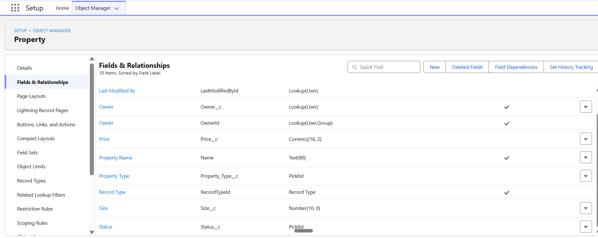 | Property Custom Object Setup |
| 03 | 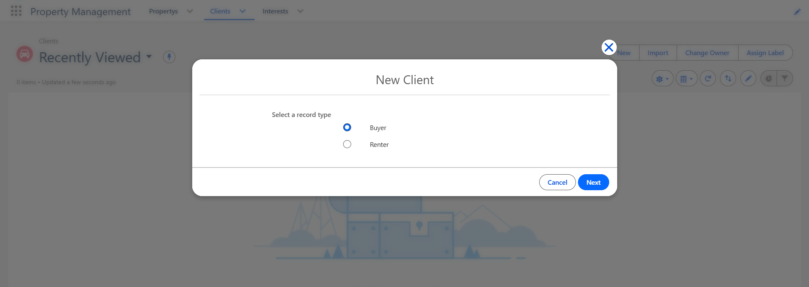 | Client Custom Object Setup |
| 04 | 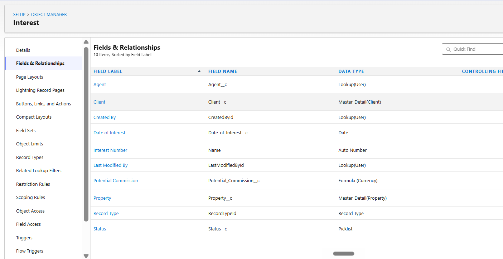 | Interest Junction Object Setup |
| 05 |  | Sample Property Record |
| 06 | 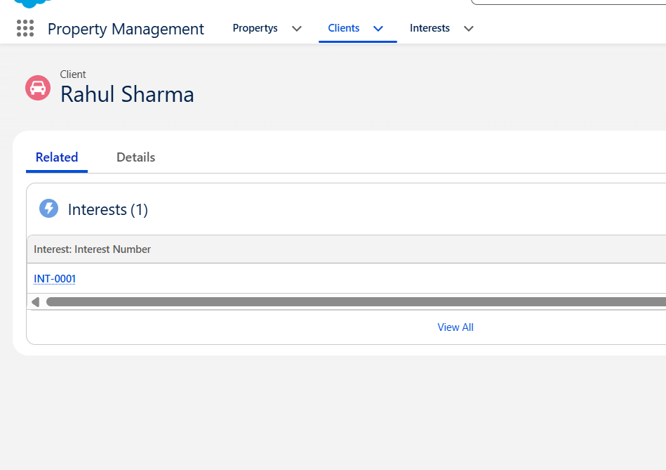 | Sample Client Record |
| 07 | 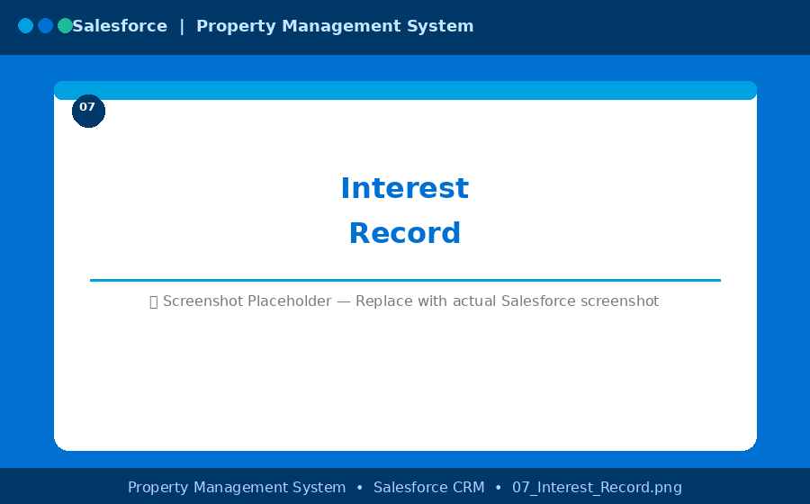 | Sample Interest Record |
| 08 | 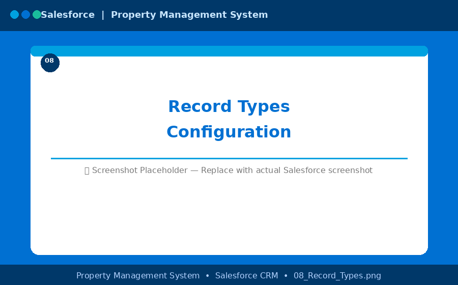 | Record Types Configuration |
| 09 | 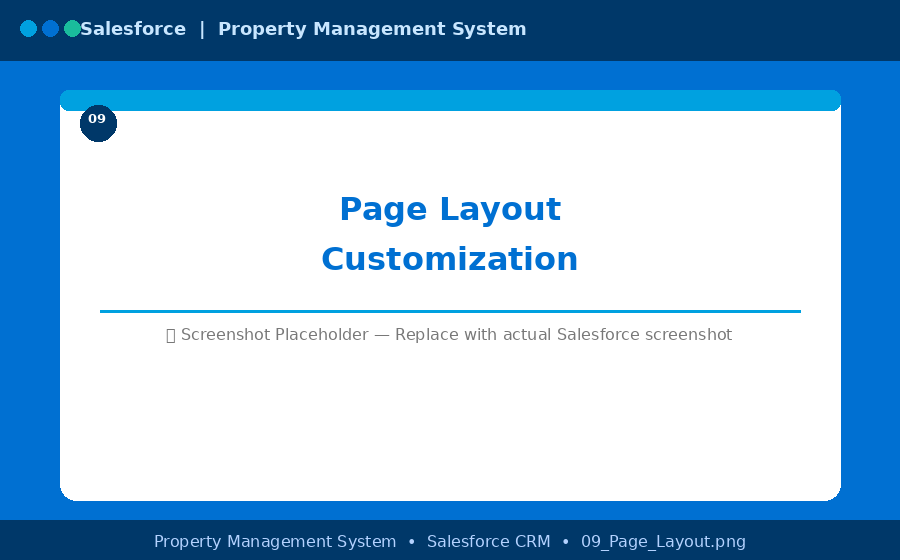 | Page Layout Customization |
| 10 | 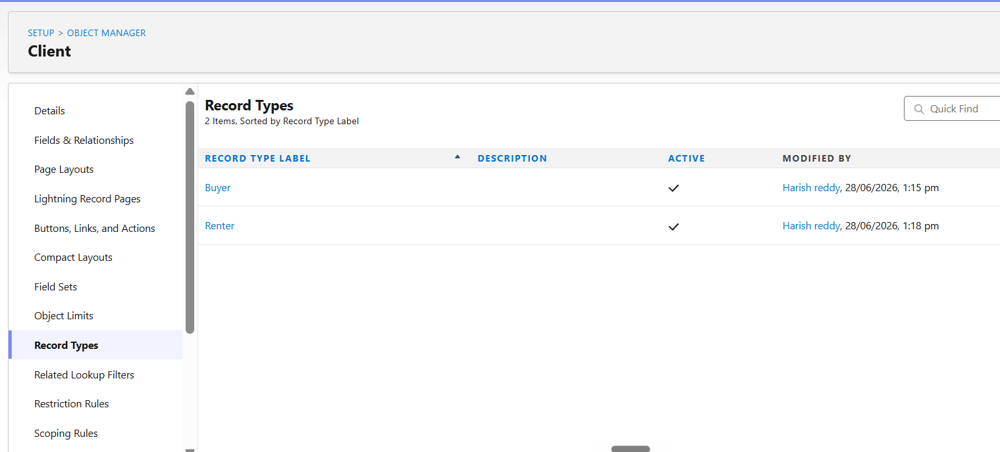 | Master-Detail Relationships |
| 11 | 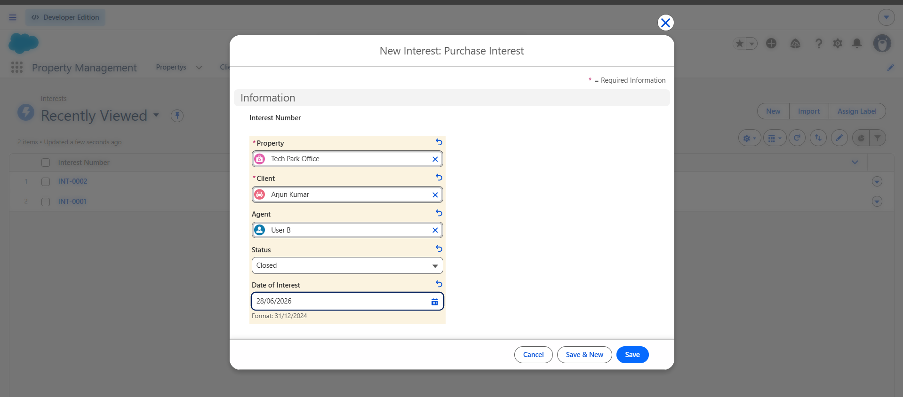 | Lookup Relationships |
| 12 | 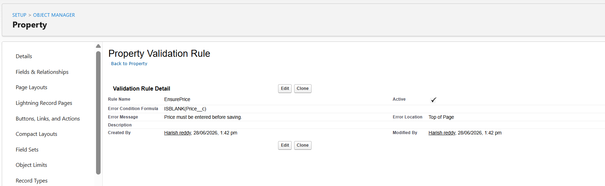 | EnsurePrice Validation Rule |
| 13 | 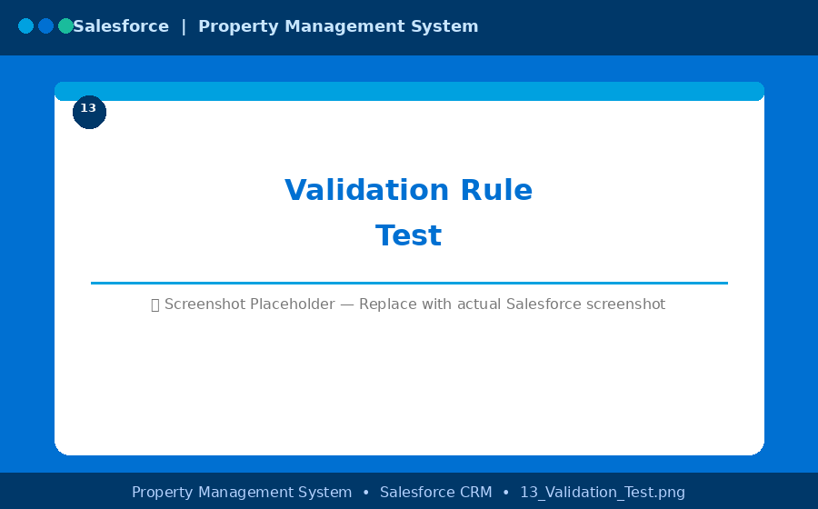 | Validation Rule in Action |
| 14 | 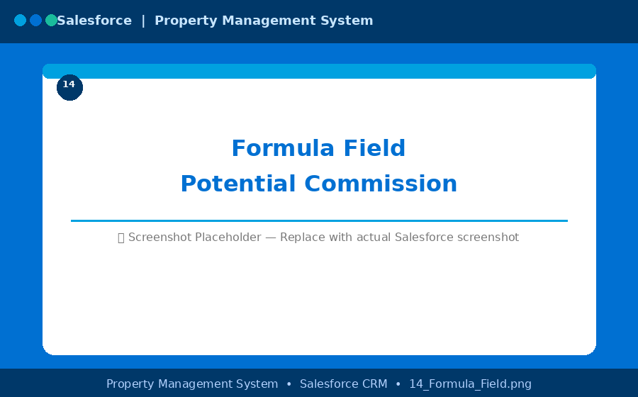 | Potential Commission Formula Field |
| 15 | 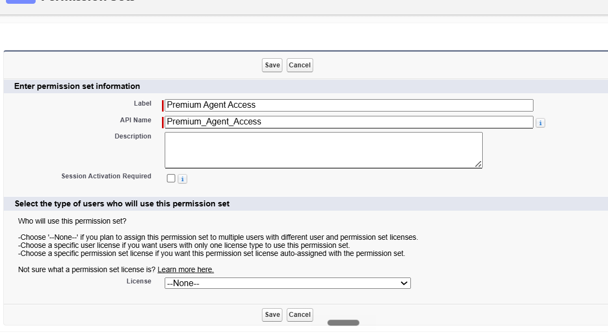 | Premium Agent Access Permission Set |
| 16 | 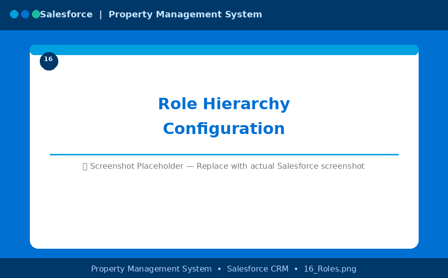 | Role Hierarchy Setup |
| 17 | 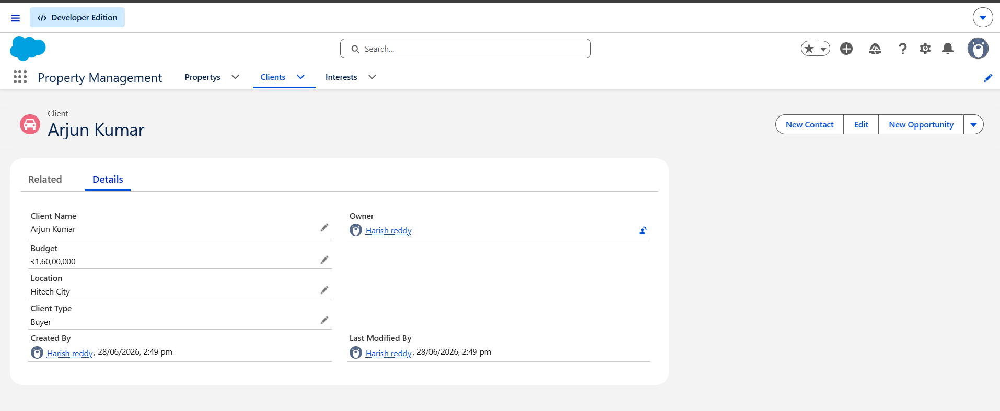 | Custom Profiles Configuration |
| 18 | 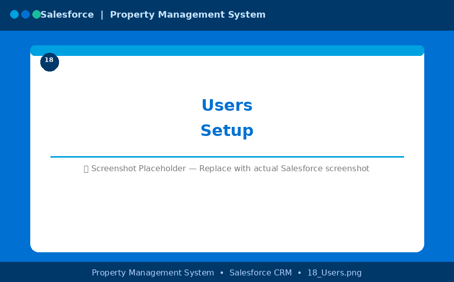 | User Accounts |
| 19 | 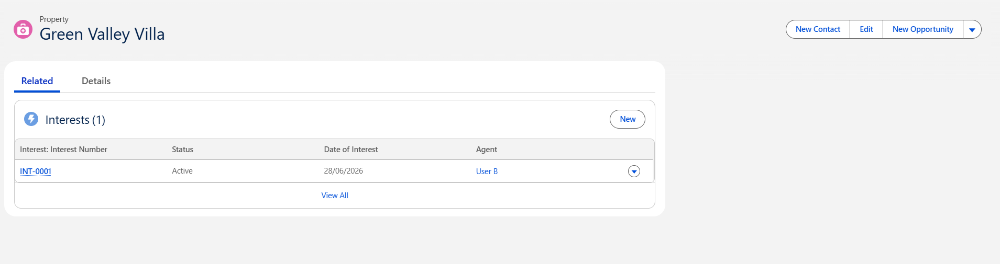 | Property-Client Relationship |
| 20 | 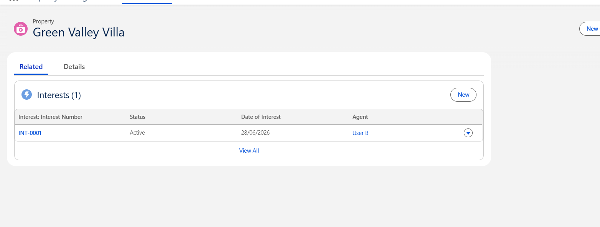 | Full Project Overview |

---

## 🧠 Learning Outcomes

Through this project, I gained hands-on experience with:

- 🗂️ **Custom Object Design** — Designing a normalized data model with relationships that mirror real-world business entities
- 🔗 **Relationship Types** — Understanding when to use Master-Detail vs Lookup relationships and their implications on record deletion and roll-up fields
- 🧮 **Formula Fields** — Building cross-object formula fields to auto-calculate commissions using `Property__r.Price__c`
- 🛡️ **Validation Rules** — Writing `ISBLANK()` conditions to enforce business rules and data quality
- 🗂️ **Record Types & Page Layouts** — Tailoring the user experience for different business processes without custom code
- 🔐 **Salesforce Security Model** — Implementing the layered security model: Org-wide Defaults → Role Hierarchy → Profiles → Permission Sets
- 👥 **User Management** — Creating users and assigning profiles, roles, and permission sets to simulate real organizational structures
- ⚡ **Lightning App Builder** — Building a unified navigation experience for real estate agents

---

## 🚀 Future Enhancements

| Enhancement | Description | Priority |
|---|---|---|
| 📊 Reports & Dashboards | Build real-time dashboards showing property pipeline, agent performance, and commission forecasts | High |
| 🔔 Workflow Automation | Use Salesforce Flow to auto-notify agents when a new interest is assigned | High |
| 📧 Email Alerts | Send automated emails to clients when their interest status changes | Medium |
| 🗺️ Google Maps Integration | Display property locations on a map within the Property record | Medium |
| 📱 Salesforce Mobile | Optimize layouts for Salesforce Mobile App usage in the field | Medium |
| 🤖 Einstein Lead Scoring | Use Salesforce Einstein to score and prioritize high-value client interests | Low |
| 🔄 Approval Process | Add a manager approval step before closing high-value property deals | Low |

---

## ⚙️ Installation & Setup

### Prerequisites

- ✅ A **Salesforce Developer Org** (Free — [sign up here](https://developer.salesforce.com/signup))
- ✅ Salesforce Admin or System Administrator profile access
- ✅ Basic familiarity with Salesforce Setup menu

### Step-by-Step Setup

```
1️⃣  CREATE CUSTOM OBJECTS
    Setup → Object Manager → Create → Custom Object
    Create: Property__c, Client__c, Interest__c

2️⃣  ADD CUSTOM FIELDS
    For each object, go to Fields & Relationships
    Add all fields as specified in the Custom Fields section above

3️⃣  CREATE RELATIONSHIPS
    Interest__c → Property__c: Master-Detail
    Interest__c → Client__c: Master-Detail
    Property__c → Owner__c: Lookup (User)
    Interest__c → Agent__c: Lookup (User)

4️⃣  CREATE RECORD TYPES
    Object Manager → [Object] → Record Types
    Property: Residential, Commercial
    Client: Buyer, Renter
    Interest: Purchase Interest, Rental Interest

5️⃣  CONFIGURE PAGE LAYOUTS
    Assign page layouts per record type
    Add Interests related list to Property and Client layouts

6️⃣  ADD FORMULA FIELD
    Interest__c → Fields & Relationships → New → Formula
    Field Label: Potential Commission
    Formula: Property__r.Price__c * 0.03

7️⃣  ADD VALIDATION RULE
    Property__c → Validation Rules → New
    Rule Name: EnsurePrice
    Error Condition: ISBLANK(Price__c)

8️⃣  CREATE ROLE HIERARCHY
    Setup → Roles → Set Up Roles
    Add: Sales Manager → Real Estate Agent, Customer Support

9️⃣  CREATE PROFILES
    Setup → Profiles → Clone Standard User
    Create: Real Estate Agent Profile, Customer Support Profile
    Set object permissions accordingly

🔟  CREATE PERMISSION SET
    Setup → Permission Sets → New
    Name: Premium Agent Access
    Assign enhanced permissions and assign to selected users

1️⃣1️⃣  CREATE USERS
    Setup → Users → New User
    Assign Profiles, Roles, and Permission Sets

1️⃣2️⃣  CREATE LIGHTNING APP
    App Manager → New Lightning App
    Name: Property Management
    Add tabs: Property, Client, Interest
    Assign to profiles

1️⃣3️⃣  CREATE SAMPLE RECORDS
    Navigate to the Property Management App
    Create test Property, Client, and Interest records
```

---

## 👨‍💻 Author

<div align="center">

**Budutha Harish Reddy**

[](https://github.com/Buduthaharishreddy)
[](https://linkedin.com/in/buduthaharishreddy)

*Data Science Intern | Salesforce Administrator | CRM & Analytics Enthusiast*

</div>

---

<div align="center">

⭐ **If you found this project useful, please give it a star!** ⭐

*Built with ❤️ using Salesforce CRM*

</div>
